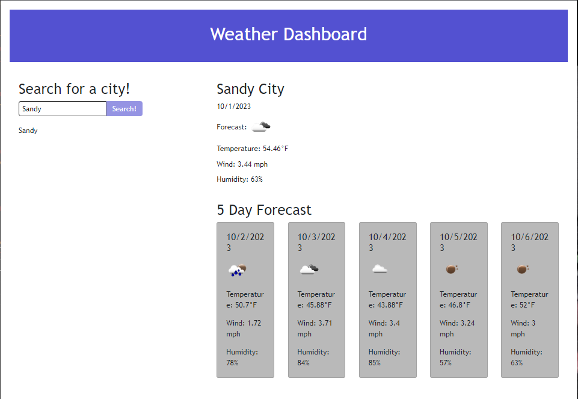

# Weather Dashboard

This application is a weather dashboard that allows the user to input a search for a city, and then yield results for todays forecast, as well as a 5 day forecast. It also has a search history functionality that allows the user to go back on previous searches.

This application utilizes many different methods and techniques we have learned throughout the bootcamp, as well as techniques learned outside of class in order to make this application functional.

I built this project in order to apply my knowledge into a real world application. Its functionalities provide actual use, and building this project has taught me how to utilize a 3rd party API and reinforced other knowledge previously learned.

## Credits

I did a lot of out of class research and learning to make this project functional. Here are a few of the resources used:

[W3 Schools](https://www.w3schools.com/)
[Code Academy](https://www.codecademy.com/)
[MDN Docs](https://developer.mozilla.org/en-US/)
[Stack Overflow](https://stackoverflow.com/)

## Deployed Site

[Weather Dashboard](https://tchr7902.github.io/weatherDashboard/)

